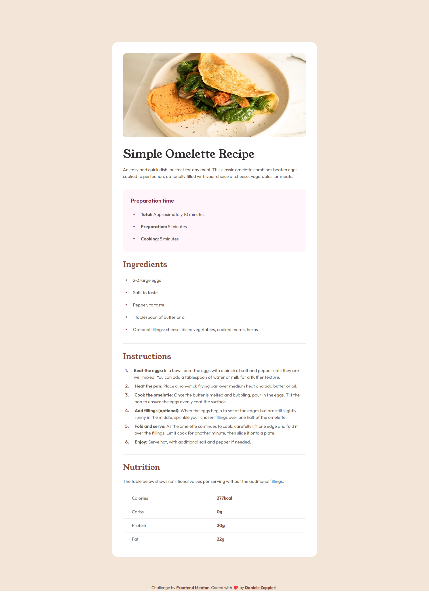

# Frontend Mentor - Recipe page solution

This is a solution to the [Recipe page challenge on Frontend Mentor](https://www.frontendmentor.io/challenges/recipe-page-KiTsR8QQKm). Frontend Mentor challenges help you improve your coding skills by building realistic projects.

## Table of contents

- [Overview](#overview)
  - [The challenge](#the-challenge)
  - [Screenshot](#screenshot)
  - [Links](#links)
- [My process](#my-process)
  - [Built with](#built-with)
  - [What I learned](#what-i-learned)
  - [Continued development](#continued-development)
  - [Useful resources](#useful-resources)
- [Author](#author)
- [Acknowledgments](#acknowledgments)

**Note: Delete this note and update the table of contents based on what sections you keep.**

## Overview

### Screenshot



### Links

- Solution URL: [Frontend Mentor page solution](https://www.frontendmentor.io/solutions/recipe-page-using-custom-marker-flex-grid-counter-variables-bem-DVHcc36uC1)
- Live Site URL: [dz-recipe-page.vercel.app](https://dz-recipe-page.vercel.app/)

## My process

### Built with

- Semantic HTML5 markup
- CSS custom properties
- Flexbox
- CSS Grid
- Mobile-first workflow
- BEM
- Logical Properties
- Custom Properties

### What I learned

With this challenge I learned a lot of things:

- Proper use of `<b>` or `span` instead that`<strong>`;
- New HTML tags that I never used before `<table>`, `<tr>`,`<td>`;
- How to style `<table>` and his elements;
- The `:last-child` pseudo-class;
- The `::marker` pseudo-element and how to work with it;
- How to create a custom `::marker` for `<ul>` and `<ol>`;
- How to work with `counter()` function.

##### Table
```html
<table>
  <tr class="d-grid">
    <td>Calories</td>
    <td class="accent"><b>277kcal</b></td>
  </tr>
</table>
```
```css
/* Style for nutrition table */
table {
    border-collapse: collapse;
}

tr  {
    grid-template-columns: 1fr 1fr;
    gap: var(--primitive-m-16);
    border-block-end: 1px solid var(--clr-divider);
}

td {
    padding-inline: var(--primitive-p-32) 0;
    padding-block: var(--primitive-p-12);
}

td:last-child {
    padding-inline: 0 var(--primitive-p-32);
}
```
##### Custom marker and counter function
```html
<ul class="card-recipe__list d-grid">
  <li class="card-recipe__list-item bullett">2-3 large eggs</li>
</ul>

<ol class="card-recipe__list d-grid">
  <li class="card-recipe__list-item numered"><span><b>Beat the eggs:</b>
    In a bowl, beat the eggs with a pinch of salt and pepper until they are well mixed.
    You can add a tablespoon of water or milk for a fluffier texture.</span>
  </li>
</ol>
```
```css
/* ul and ol style */
.card-recipe__list {
    gap: var(--primitive-m-8);
    padding: 0;
}

/* Set marker position inside to ol */
.card-recipe__section > ol {
    list-style-position: inside;
    counter-reset: list-num;
}

/* General style for li items */
.card-recipe__list-item {
    display: flex;
    gap: var(--primitive-m-28);
}

/* Align bullett points vertically
   center with the text inside li
*/
.bullett {
    align-items: center;
}

/* Define bullett points for ul li */
.bullett::before {
    position: relative;
    content: '\2022';
    left: var(--primitive-m-8);
    font-size: 1.5rem;
    color: var(--clr-cardSectionHeading);
}

/* Bulletts modifier to set the color
   to the bulletts of card banner*/
.bullett--info::before {
    color: var(--clr-cardInfoHeading);
}

/* Define number points for ol li */
.numered::before {
    position: relative;
    counter-increment: list-num;
    content: counter(list-num) ". ";
    left: var(--primitive-m-8);
    font-weight: var(--fw-bold);
    color: var(--clr-cardSectionHeading);
}
```

### Continued development

Within next challenge I want to continue focusing on **CSS Grid**, reinforce my knwoledge with the elements that I learned in this challenge, both side, **CSS** and **HTML** and even start to use some **JavsScript**.

### Useful resources

- [How to use :last-child selector](https://developer.mozilla.org/en-US/docs/Web/CSS/:last-child) - I found this link usefull because I know the concept of that selector, but I never work with it and I didn't know the syntax.

- [Getting started with table](https://developer.mozilla.org/en-US/docs/Web/HTML/Element/table) - As mentioned before there is some **HTML** tag that I never use before, I use thi article to start with it.

- [More Docs on table and his childs](https://www.w3schools.com/html/html_tables.asp) - Just another reference to build a nice table.

- [Use b or span instead of strong](https://html.com/tags/strong/) - This article was help me to understand wich **HTML** tags was more appropriately to **bold** text.

- [How to create a custom marker for a list](https://stackoverflow.com/questions/78394172/centering-vertically-multiple-line-list-element-to-the-dot) - This article from stackoverflow contain the solution that I applied to make custom marker for the `li` tags.

- [More on how to create custom marker](https://idkshite.com/posts/vertical-center-bullet) - I didn't use this method but I tried it and I think in other scenarios it could be usefull.

- [Why we need a custom marker](https://stackoverflow.com/questions/71911768/css-list-marker-not-inline-with-text) - This article explain why in certain case we need to use custom marker.

- [A Guide to CSS counter](https://www.samanthaming.com/tidbits/53-css-counter/) - A usefull guide to work with **CSS** `counter()` function, I used it as reference to build up custom marker for `<ol>` in my project.

- [`article` vs `section`](https://www.smashingmagazine.com/2020/01/html5-article-section/) - A good article about the right choose of `<article>` over `<section>` element

- [CSS Reset by Andy Bell](https://piccalil.li/blog/a-more-modern-css-reset/) - As every challenge the **CSS** Reset by Andy Bell.

## Author

- Frontend Mentor - [@dedo-dev](https://www.frontendmentor.io/profile/dedo-dev)
- Linkedin - [@daniele-zeppieri](https://www.linkedin.com/in/daniele-zeppieri-0b1a36252/)

## Acknowledgments

A special thanks to [@Code-Beaker](https://www.frontendmentor.io/profile/Code-Beaker), he suggested me to split my CSS into multiple files to keep it cleaner (Ex. `index.css`, `variable.css`, `reset.css`).